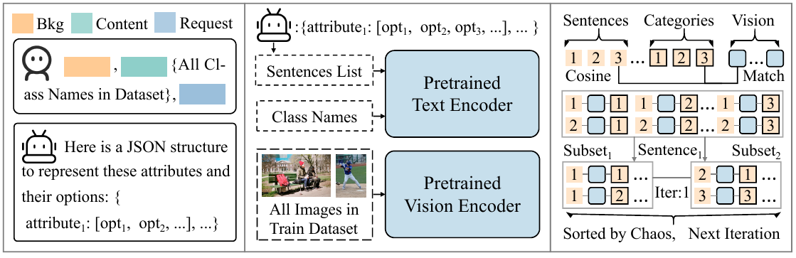

# OV-DDT: Toward Application of Open Vocabulary Object Detection with Differentiable Decision Tree

## Abstract
Open Vocabulary Object Detection (OVOD) has attracted widespread attention due to its powerful generalization capabilities. However, existing methods predominantly emphasize performance on public standard datasets (e.g., LVIS), often overlooking fine-tuning techniques applicable to real-world environments. To address this gap, we propose OV-DDT, a novel fine-tuning method designed to bridge the divide between research and practical application. Our method emphasizes two critical metrics for application environments: performance and interpretability, ensuring both accuracy and safety. To achieve this, we employ a differentiable decision tree. Specifically, our approach involves three steps to generate a decision tree for object description. First, we generate unbiased category descriptions using a large language model. Second, we generate split features leveraging the generalization capabilities of the visual encoder. Third, we transform the tree-building task into an iterative partitioning problem to generate routes. OV-DDT utilizes soft partitioning to generate path selection probabilities, ensuring that all operations remain differentiable. Additionally, OV-DDT can be embedded as a classifier within the OVOD detector. We evaluated OV-DDT across five datasets, comprising four application-specific datasets and the standard COCO dataset. Our results indicate that OV-DDT significantly outperforms prompt fine-tuning methods, achieving, for instance, an absolute gain of +8 mAP on the application datasets.

## Method

